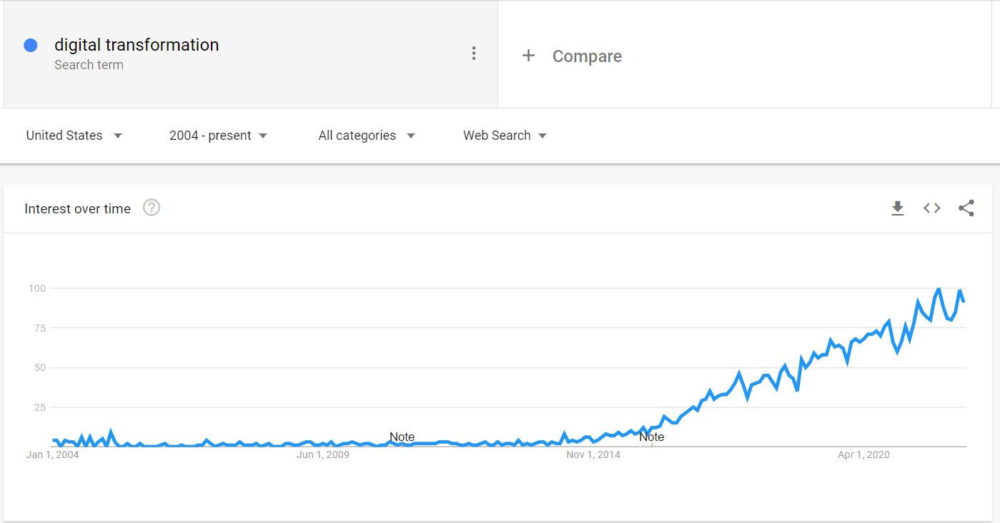
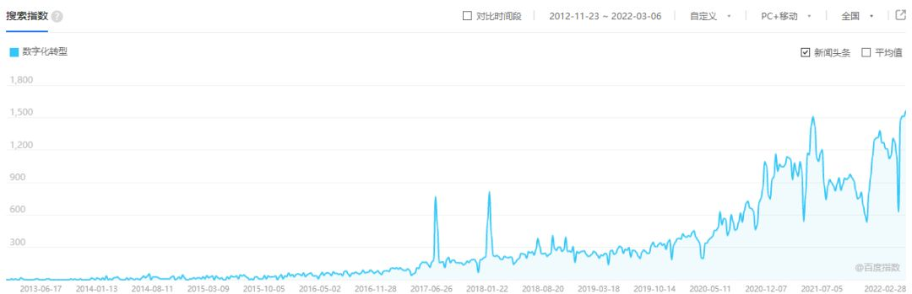
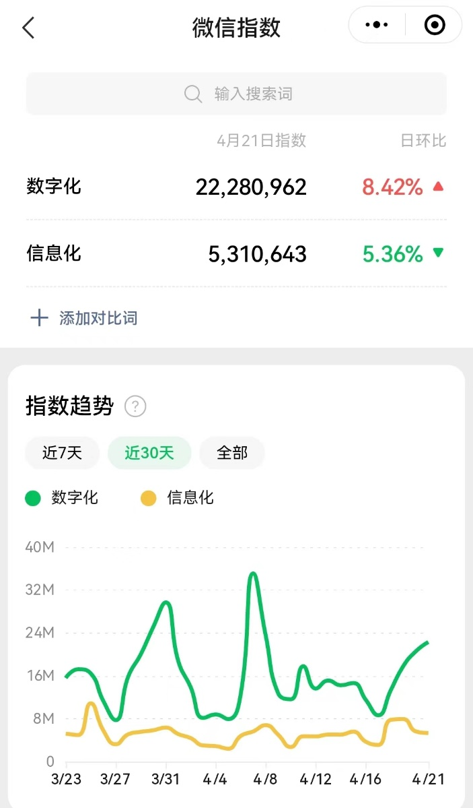
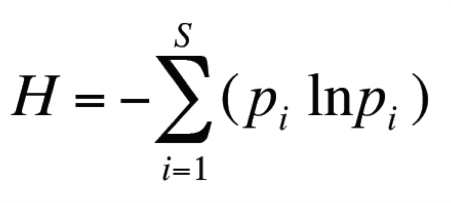

# 信息化与数字化有本质的区别么

在2035年传统燃油车被完全替代后，为了解决充电时间长的难题，有人突然提出一个创意：“有没有可能发明一种液体，汽车加上2分钟就能跑几百公里？” 这条许多电动车车主都看到过的冷笑话。在电动车发展到今天，由于充电桩不足导致的弊端经常让电动车主想起这个冷笑话。电动车与燃油车的本质上的竞争差异还是能量密度与成本，其次再是这两种不同的技术架构带来的其他区别：智能化、加速性能、静音指标等。如果一升汽油能够续航500KM，所有的燃油车额外加个电机再智能化也不是件难事。

同样的冷笑话也存在数字化转型这个领域中。市场上每隔一段时间就会出现新的技术和营销名词，因为新的厂商想要获得增长，就必须在传统的巨头垄断的领域里创造出差异化的概念。用数字化否定信息化，用低代码平台否定ERP，用大数据否定关系型数据库，用微服务否定大型单体应用。很多的名词背后是完全不同的应用场景，不同的场景选择不同的技术，不同架构的选择是需要在收益和成本之间做权衡的，了解事务的本质后才能做更好的判断。

从谷歌趋势指数图上可以大概判断出数字化转型这个名词在国外是2015年开始流行起来。2015年也是人工智能、云计算、大数据大力发展的时代，从2015年开始几个云计算公司的股价丈夫开始大幅超越传统软件和服务公司。2015年亚马逊第一次公布AWS业绩时，股价即暴涨了14%，自由现金流从19亿美元突增至73亿美元。

从国内的百度指数来看在国内这个概念大概是2017年之后尤其是疫情后开始爆发起来。

在2022年的微信指数上也能看出，数字化的搜索指数已经远超信息化了。

从信息化到数字化，是质变还是量变？对于信息化与数字化的区别，在媒体里也有各种不同的解读，大概的收集了一些：

1. 信息化更偏系统建设，数字化更偏业务。
2. 信息化更偏稳态，数字化更偏敏态变革。
3. 信息化更偏流程管理，数字化更偏业务赋能
4. 信息化更偏流程，数字化更偏数据
5. 信息化是管理视角，数字化是生意视角
6. 信息化是为了降本增效，数字化是为了创新
7. 信息化就是以人为主以机器为辅，数字化就是以机器为主以人为辅
8. 信息化是为物理世界活动服务的，数字化是为数字世界服务的
9. 信息化是从业务到数据，数字化是从数据到业务
10. 传统企业做的都是信息化，互联网企业做的才是数字化
11. 信息化依赖软件厂商，数字化需要自力更生
12. 信息化更偏内部的系统，而数字化与客户和合作伙伴有更多的连接（在线化）
13. 数字化是信息化的高阶阶段，是信息化的广泛深入运用，是从收集、分析数据到预测数据、经营数据的延伸
14. 信息化是各部门单独建设系统形成数据孤岛，数字化是是用数据将业务整合成闭环
15. 信息化是从业务到数据，数字化是从数据到业务
16. 信息化不改变商业模式，而数字化要改变商业模式
17. 把物理世界冻结了（比如疫情）还能业务运转的才叫数字化

用一个简单的例子，比如相机拍照的业务。20年前的胶片照片和数码照片的区别大家应该非常容易理解。胶片相机的模式是，胶片曝光后，部分卤化银在光的作用下生成潜影，经过显影、定影，把这些潜影变成可见影像，并经印相或放大，方能得到与景物明暗“类似”的照片。胶片相机从拍照到最后得到相片的过程中，都是物理世界到物理世界的转化，其中每一个环节都有可能存在信息”失真”的过程。数码相机在拍完照后储存为二进制的数字格式，最后通过照片打印机再输出为物理世界的实体。数码相机的整个拍照过程也存在两次”失真“的环节，数码相机传感器的模拟到数字的转化，和最终打印机的数字到模拟的转化。当风景转化为数字媒体后，设计师用Photoshop或者AI技术可以对照片进行随意的修改，在数字领域重构内容的成本非常低，远远低于模拟时代的胶片修复，利用AI的功能也能大规模复制之前的设计师的知识能力。在现在的摄影工作室里，拍照环节和照片打印环节所占的时间和成本已经越来越低了。在数字媒体领域，也可以诞生非常多的新的业务模式，比如Netflix和Spotify等新的业务模式的公司。

无论是胶片相机，还是数码相机，甚至是由画像手绘的一副风景画，其本质功能是什么？我们做这一切都是为了信息的有效传递，当你看到一张照片的时候。通过胶片制作的照片具有信息传递的功能，通过数码相机制作的照片也有信息传递的功能。

中文确实是博大精深，信息和数字这两个名词其实挺好理解，科学理论上也有比较明确的解释，但是加了一个”化”字以后大家就开始有各种不同的理解了。美国数学家，信息论的奠基人克劳德·艾尔伍德·香农（Claude Elwood Shannon）在他的著名论文《通信的数学理论》（1948）中提出计算信息量的公式。 这个公式和热力学的熵的本质一样，故也称为熵。

从公式可知，当“不确定性”最高时，信息熵最大。故信息可以视为“不确定性”或“选择的自由度”的度量。在很多时候，我们远远低估了信息这个词的含义和范围，我们日常口头沟通中的信息是指能减少不确定性的事务或者描述，信息越多，不确定性越低。信息的定义是包含数字和其他的表现形式的，并且以数字方式存在的信息最终也需要通过物理的方式让人感知到，比如通过声音、照片、屏幕、视频等交互方式。

对于企业来说，追求的是确定性还是不确定性？从估值的角度来讲，确定性的预期能够有更好的估值。企业不同于个人，企业是一个组织，是由许许多多的人和各种资产组合起来的一个组织，能够在一定的边界条件内组织各种资源进行大规模生产、服务是企业生存的目的。降低组织中各个环节的不确定性和失真，是企业保持竞争的关键要素。所以，对于一个企业来说，减少不确定性是信息化/数字化的最重要的目的。无论是在线化提供的信息透明，电商提供的一日达快递，还是云服务能提供的一键部署，都是降低了信息和交易的不确定性，从而可以实现业务的低成本扩张。在信息的传递过程，既有数字的方式，也有非数字的方式。比如在一个讲堂里开动员会，直接开始演讲的信息传递效率，可能会比直接通过数字传播的方式效果更好。

还是从胶片相机和数码相机的例子来展开。胶片相机传递信息的每个过程都可以理解为物理世界到物理世界的转化，而数码相机传递信息的过程有物理世界到数字世界，数字世界到数字世界，数字世界到物理世界。这里可以借用电子行业的一些专用术语来描述大家可能理解的会更简单一些，模拟到模拟的转化，模拟到数字的转化，数字到数字的转化，数字到模拟的转化。这四个环节里最大的区别是什么？数字到数字的转化有可能做到100%的信息无损。如果一个企业的业务环节多了以后，信息从企业传到到员工，从需求传递到生产，从研发传递到销售，都有可能出现严重的信息失真，从而使得企业无法在规模生产下保持获利。

| 源\目的地 | 模拟 | 数字     |
| ----- | -- | ------ |
| 模拟    | 失真 | 失真     |
| 数字    | 失真 | 可以做到无损 |

胶片相机里成像的环节是一个模拟到模拟的过程，如果用的胶卷不一样最后得到的照片区别非常大。数码相机的传感器是一个模拟到数字的过程，不同传感器对光线、颜色的敏感度不同，传感器尺寸、像素大小不同，记录下来的数字文件也有很大的区别。数码照片的传输过程是一个数字到数字的过程，如果是无损复制传输的话，每次可以得到一样的结果。数字到模拟的过程，不同的照片打印机产生的照片效果也有很大的区别，即使是同样的照片最后在不同的人眼里可能也会产生不同的信息（比如色盲）。

在组织的管理上，一致性会提高企业管理的确定性，从而提升企业的价值。福特的流水线作业，以流程为本、保证流程本身的顺畅和效率是流水线生产的精髓，这其中的奥秘就是降低每个环节的不确定性。

信息化不仅仅是指从物理到数字的过程，这个过程有一个更狭窄的名词叫数码化：将

信息和文档从模拟格式转换为数字格式，这个只是信息归档而已。过去几十年的信息化建设过程中，企业并没有仅仅停留在将物理信息投射到数字世界这个环节上，无论是OA、CRM、ERP、BI、管理驾驶舱最终的目的都是为了帮助业务完成闭环，完成有效的信息传递和组织执行。尤其是ERP的管理理念，涉及到对物理世界的数据建模，对各种主数据的严格定义，对生产销售环节的模拟，主数据和业务数据的信息交互，用最优化的流程来指导生产和销售的大规模扩张。一个企业的业务逻辑越接近最优化和规模化，就越容易用ERP的数字逻辑来描述和指导整个业务体系。一个优化到极致的业务，可以把物理节点和数字节点看作一个新的整体的物理节点，比如无人工厂，里面可能涉及到很多的物联网、大数据和AI算法，但是作为一个整体其输入输出非常稳定，就跟一个物理世界里的标准零配件一样不用再让人操心。

但是在最近十年，各类企业对ERP的精准模拟的方式有些力不从心，外界环境变化太快，很难让自己的业务逻辑长期保持在最优化和规模化的区间。即使是互联网企业，由于技术迭代更新速度快，一些头部企业也很难用传统计划的方式让自己保持住竞争，业务的优化迭代、固化、扩大规模这样的周期太长了，很多企业可能还没能走完一个完整的周期业务就开始转型了。在这种环境下，一个企业可以退而求其次追求不那么优化的业务数字体系，用统计学概率学的方式来做敏捷的规划，允许业务和数字体系上存在一定的不确定性，这个对应的是大数据体系。另外的办法就是一个企业走向外部走向生态，让自身的业务完全融入到整个社会的生产体系中，从而降低某些维度的不确定性，这样就需要一个全新的规模更大的数字业务体系。

我们的真实业务流程由非常多的“物理到物理”、“物理到数字”、”数字到数字“、”数字到物理“环节构成。充分利用这几个环节的优劣点，设计属于自己的业务架构。拿发票报销这个环节来说，之前大家住酒店需要开纸质发票回来扫描报销的过程，涉及到的多个环节都可能存在信息失真的问题，比如自己记错了法人体的税号信息，酒店前台敲错了发票信息，发票在公司内部扫描可能出错或者无法识别的问题，报销系统识别后也可能存在金额与项目规定不符合的问题。使用电子发票后，可以明显的减少各个环节的信息失真问题，减低企业与员工的经济成本和时间成本，从而提高效率。住酒店的交易这个信息，借助发票电子化这个数字化的传递可以降低信息失真的概率和成本。

但是企业数字化的历程远没有这么简单，企业对于信息还有其他维度的诉求，比如信息在外部的传递，信息的隐藏，信息的转化。即使是在纯粹的数字到数字的转化过程中，也可能会存在信息的失真和成本的急剧上升。目前大部分企业还做不到信息完全透明和无损的传递，完全对外开放，甚至是完全对内开放。企业在数字化建设的过程中，甚至还会引入许多模拟的环节，来隐藏和转化信息。即使是一些大家认为数字化非常彻底的互联网电商平台或者打车平台，也会因为算法造出千人千面的价格体系，形成信息的失真。

“数字到数字”的环节也可能存在失真。0/1本身的数据是几乎没有信息含量的，就跟图像传感器收集到单一的像素点只能提供亮度和颜色的信息，只有跟其他的像素点组合在一起的时候，才可以传递出人类能够理解的信息。

不同的数据组合在一起，可以传递不同的信息，数据组合的规则不同其传递出的信息也不同。数据的组合和加工在很大程度上因为引入了人和组织的主观因素，也相当于参杂了一个模拟的环节，使得信息在表达的过程中出现失真。拿企业的财务报表为例，每个国家都有自己的不同的财务规则，同一个业务的一堆财务凭证数据也可以生成不同财务报表。财务凭证的生成是一个物理到数字的过程，本身就有大量的信息损失。而财务规则由于是人为制定的，每个组织的讨论结果都存在信息失真的可能。

我们还是前最“纯粹”的数字化场景来解释数字化的远景，目前比较火的词大概就是元宇宙了。我们社会可以简单地分为物理世界和数字世界；现实社会中，我们有人财物和这三者之间的各种组合和价值交换，数字世界里也有信息熵和能量。一个比较接近原生的数字世界，可以是一个游戏的线上运营，它需要的能量可以靠太阳能，里面的玩家也可以是AI或者人类玩家，游戏的代码本身是数字世界的一部分，经济体可以用区块链来设计，这样的系统其实可以完全不依赖于人类。在这样的系统里，业务可以完全以数字化方式来运转。在原生的数字世界中，信息在不同节点之间的传递是无损的。在这个数字原生世界里，是否能够完全不依赖于物理世界呢？很可惜的是不能，在物理学上物质和能量其实是同一个概念。离开了能量的元宇宙体系，是无法完成信息的传递、变化和组合的，最终只是一堆信息的记录体而已。所以在哲学和物理上的层面上，纯粹的”数字世界”是无法做到独立运转的，数字世界想要模拟物理世界离不开“模拟到数字”的环节，目前人类理解信息还是离不开”数字到模拟”这个必要的一环。

信息化这个概念提出了那么多年后，数字化这个概念开始流行起来，也体现了”数字到数字”这个环节起到了越来越重大的作用，也有很多的潜力可以挖掘，在信息化的建设过程中”数字到数字”的比例也越来越大。以后也会花一些时间来分享下，为什么”数字到数字”能够帮助一些企业做业务的转型。在数字化这个概念之后，下一个流行的词汇是什么呢？如果让我来选的话，我会选“熵减”，这个词语的歧义更少，指向清晰，也不用再加一个”化”的后缀。信息化、数字化的最终目的还是为了组织的熵减，能够更有竞争力，在企业业务架构设计上我们也更应该关注总体的信息的失真和传递的成本。
